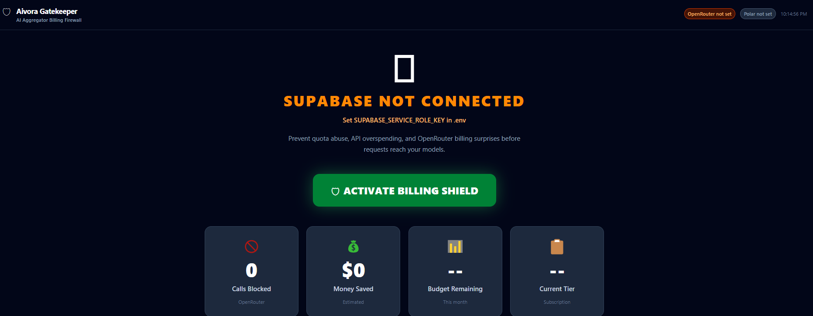
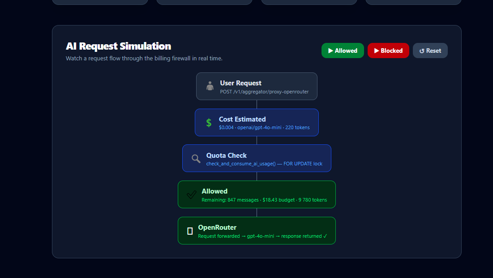
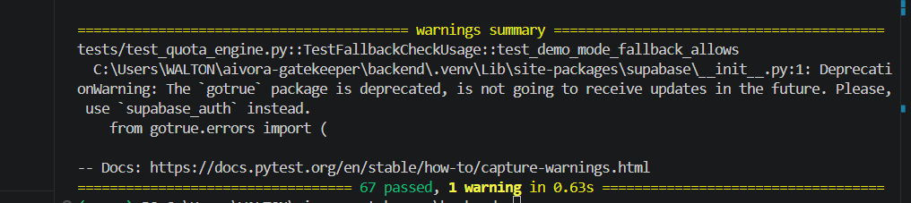

# Aivora Gatekeeper

**AI Aggregator Billing Firewall for OpenRouter, Supabase, and Polar.sh**

Protect AI aggregator platforms from quota abuse, spam requests, and surprise OpenRouter bills before requests reach expensive models.

---

## Status

| Check | Result |
|---|---|
| Demo mode | ✅ Ready — runs fully without provider credentials |
| Automated tests | ✅ 67 / 67 passed (`pytest`) |
| Frontend build | ✅ Clean (`tsc -b && vite build`) |
| Python syntax | ✅ Clean (`python -m compileall app`) |
| GitHub secret scan | ✅ No secrets committed |
| Production deployment | ⚠️ Requires Supabase, OpenRouter, and Polar.sh credentials |

> **Honest assessment:** This is a demo-ready billing firewall prototype with a solid technical foundation.
> Full production deployment requires applying 17 database migrations to a live Supabase project,
> configuring real provider API keys, and hosting the backend service.

---

## The Problem

Every AI aggregator that proxies user requests to OpenRouter (or any LLM provider) faces the same three threats:

| Threat | What happens |
|---|---|
| **Runaway loops / bugs** | One misbehaving client empties your monthly budget in minutes |
| **Spam and abuse** | Malicious users make thousands of requests at your cost |
| **No visibility** | You discover the problem on your billing statement, not in real time |

Without enforcement, a single user sending `10 000 requests × $0.018/request` generates **$180 of unplanned spend** with no warning.

Monthly budget caps enforced at the user level do not cover multi-tenant scenarios where a single workspace can exhaust the budget across many users simultaneously. Dollar-level enforcement at the LLM provider (OpenRouter) is available but coarse — it does not enforce per-user or per-subscription-tier limits.

---

## The Solution

Aivora Gatekeeper sits between your application and OpenRouter. Every AI request is quota-checked and cost-estimated **before** it reaches the model. If it would exceed the user's or workspace's budget, it is blocked with a structured 429 response. OpenRouter is never called.

```
User Request
    │
    ▼
Aivora Gatekeeper (FastAPI)
    │
    ├─ 1. Workspace monthly budget gate   ← workspace_check_and_consume_usage()
    ├─ 2. User monthly message limit      │  All four checks in one atomic
    ├─ 3. User monthly dollar budget      │  Supabase RPC with SELECT … FOR UPDATE
    └─ 4. User token bucket (rate limit)  ◄─ no race conditions, no Redis needed
    │
    ├─ BLOCKED → 429 {"reason": "workspace_budget_exceeded"}
    │            OpenRouter is never called
    │
    └─ ALLOWED → forward to OpenRouter → return response to user
                 usage counters updated atomically in same transaction
```

**Two integration modes:**

```typescript
// Mode A: pre-flight check (you forward to OpenRouter yourself)
const gate = await fetch('/v1/aggregator/check-usage', {
  method: 'POST',
  body: JSON.stringify({
    user_uuid:        session.user.id,    // Supabase auth UUID
    provider:         'openai',
    model:            'gpt-4o-mini',
    estimated_tokens: 500,
    estimated_cost:   0.0001,
  }),
})
const { allowed, reason, remaining_budget_usd } = await gate.json()
if (!allowed) return NextResponse.json({ error: reason }, { status: 429 })
// Safe to forward to OpenRouter now

// Mode B: full gate-and-forward proxy (one endpoint does both)
const response = await fetch('/v1/aggregator/proxy-openrouter', {
  method: 'POST',
  body: JSON.stringify({
    user_uuid:  session.user.id,
    model:      'openai/gpt-4o-mini',
    messages:   [{ role: 'user', content: userMessage }],
    max_tokens: 1024,
  }),
})
```

---

## Key Features

### Quota Enforcement
- **Atomic 4-layer quota hierarchy** — workspace budget → user message limit → user dollar budget → user token bucket, enforced in a single PostgreSQL transaction with row-level locking
- **Token bucket rate limiting** — continuous-refill algorithm implemented as PL/pgSQL; no Redis or external locking service required
- **OpenRouter proxy guard** — cost estimated before forwarding; provider is never called if quota is denied
- **Circuit breaker fallback** — CLOSED → OPEN → HALF_OPEN state machine; fails-closed in production if Supabase is unreachable

### Billing and Subscriptions
- **Polar.sh subscription tier sync** — HMAC-SHA256 verified webhooks update subscription tier and quota in real time
- **Provider cost table** — 17 models across 6 providers (OpenAI, Anthropic, Google, Meta, Mistral); editable in the database without a code deploy

### Multi-Tenant Workspaces
- **Workspace monthly budget caps** — hard USD limit across all workspace members; blocks immediately when exceeded
- **Budget alert thresholds** — automatic events at 50%, 80%, 95%, and 100% of budget; idempotent, fires once per threshold per month
- **Spend anomaly detection** — background detection of spend spikes and budget trajectory violations; 24-hour dedup

### Security and Access
- **JWT authentication** — Supabase JWT verification on all workspace and admin routes
- **RBAC** — owner, admin, and member roles enforced per workspace via `workspace_members` table
- **Row Level Security** — all 13 database tables have RLS policies; users cannot read other users' data even if application logic is bypassed

### Observability
- **Admin analytics API** — platform-wide stats, workspace usage, anomaly feed, suspend/unsuspend controls
- **Invoice summary API** — per-month invoice with per-member cost breakdown; one SQL RPC call
- **Prometheus metrics** — `GET /metrics` exposes counters and histograms for quota decisions, latency, circuit breaker state, and cache performance
- **Structured logging** — structlog; JSON in staging/production, human-readable in development
- **Immutable audit trail** — `api_logs` table is append-only; `REVOKE UPDATE, DELETE` enforced at PostgreSQL level

### Operations
- **Liveness probe** — `GET /health` returns `ok` or `degraded`
- **Readiness probe** — `GET /ready` returns 200 when Supabase is connected, 503 otherwise (k8s ready)
- **Backend Dockerfile** — multi-stage, non-root user, `HEALTHCHECK`, compileall at build time
- **Frontend Dockerfile** — Node build + nginx:alpine serve, gzip, 1-year cache on hashed assets

---

## Architecture

```
Browser / Next.js API Route
          │
          │  HTTP
          ▼
┌─────────────────────────────────────────────────────────────────┐
│  React Dashboard  (Vite 8 + Tailwind CSS v4)                    │
│  • Polls  GET /v1/aggregator/status  every 30 s                 │
│  • Single-screen Grandma Theory UI — one status, one button     │
└──────────────────────────┬──────────────────────────────────────┘
                           │  HTTP  (port 8000)
                           ▼
┌─────────────────────────────────────────────────────────────────┐
│  FastAPI Gatekeeper  (Python 3.12 · uvicorn)                    │
│                                                                 │
│  ┌───────────────────────────────────────────────────────────┐  │
│  │  CORSMiddleware                                           │  │
│  └──────────────────────┬────────────────────────────────────┘  │
│                         │                                       │
│  ┌──────────────────────▼────────────────────────────────────┐  │
│  │  GatewayMiddleware  (quota enforcement on all routes)     │  │
│  │  • Validate X-User-UUID · estimate token cost             │  │
│  │  • InMemoryCache fast-reject (TTL 15s blocked)            │  │
│  │  • CircuitBreaker.call(supabase_rpc, fallback)            │  │
│  └──────────────────────┬────────────────────────────────────┘  │
│                         │                                       │
│  ┌──────────────────────▼────────────────────────────────────┐  │
│  │  Route groups                                             │  │
│  │  /health  /ready  /metrics                                │  │
│  │  /v1/gatekeeper/*    (token-bucket oracle)                │  │
│  │  /v1/aggregator/*    (OpenRouter proxy + Polar webhooks)  │  │
│  │  /v1/workspaces/*    (multi-tenant workspace management)  │  │
│  │  /v1/admin/*         (platform ops — JWT admin required)  │  │
│  │  /v1/invoices/*      (billing analytics)                  │  │
│  └──────────────────────┬────────────────────────────────────┘  │
└─────────────────────────┼───────────────────────────────────────┘
                          │  Supabase RPC
                          ▼
┌─────────────────────────────────────────────────────────────────┐
│  Supabase  (PostgreSQL 15 + PostgREST)                          │
│                                                                 │
│  workspace_check_and_consume_usage()                            │
│    ├─ workspace budget gate          (workspaces table)         │
│    ├─ user message limit             (usage_counters)           │
│    ├─ user dollar budget             (usage_counters)           │
│    ├─ token bucket drain             (user_quotas FOR UPDATE)   │
│    ├─ workspace aggregate update     (workspace_monthly_usage)  │
│    └─ budget alert threshold check  (_fire_budget_alerts)       │
│                                                                 │
│  13 tables · 10 RPCs · RLS on every table · 3 immutable logs    │
└─────────────────────────────────────────────────────────────────┘
```

**Circuit breaker states:**

```
         5 consecutive failures
CLOSED ──────────────────────────► OPEN  (fallback: fail-closed in prod)
  ▲                                   │
  │                                   │ after CB_RECOVERY_TIMEOUT_SECONDS (60 s)
  │                                   ▼
  └──── 2 consecutive successes ── HALF_OPEN  (probe)
```

---

## Screenshots

> Run the stack locally (see [Local Development](#local-development)) to generate these.

| View | Preview |
|---|---|
| Dashboard — Billing Firewall Active |  |
| AI Request Simulation Flow |  |
| Test Suite — 67 / 67 Passed |  |

---

## Local Development

### Prerequisites

- Python 3.11+
- Node 20+
- Supabase CLI (optional — only needed for Mode B with a real database)

### Mode A — Demo (no Supabase required)

Runs the full stack with quota enforcement disabled. All requests pass through. Useful for UI development and stakeholder demos.

```bash
# 1. Configure backend
cp .env.example .env
# Edit .env and set:
#   DEMO_MODE=true
#   GATEWAY_FAIL_OPEN=true

# 2. Start backend
cd backend
python -m venv .venv

# Windows
.\.venv\Scripts\Activate.ps1
# macOS / Linux
source .venv/bin/activate

pip install -r requirements.txt
uvicorn app.main:app --reload --port 8000

# 3. Configure frontend
cp frontend/.env.example frontend/.env
# Edit frontend/.env and set:
#   VITE_DEMO_MODE=true

# 4. Start frontend
cd frontend
npm install
npm run dev
```

Dashboard: `http://localhost:5173` · API docs: `http://localhost:8000/docs`

### Mode B — Production Integration (Supabase required)

```bash
# 1. Apply all 17 database migrations (see docs/MIGRATION_ORDER.md)
for f in database/migrations/*.sql; do psql "$DB_URL" -f "$f"; done

# 2. Apply seed data (billing tiers only)
psql "$DB_URL" -f database/seeds/001_billing_tiers.sql

# 3. Provision a test user
psql "$DB_URL" -c "SELECT provision_user_quota('<your-user-uuid>'::uuid, 1);"

# 4. Configure backend with real credentials
cp .env.example .env
# Edit .env: set SUPABASE_URL, SUPABASE_SERVICE_ROLE_KEY, OPENROUTER_API_KEY

# 5. Run
cd backend && uvicorn app.main:app --reload --port 8000
cd frontend && npm run dev
```

### Running Tests

```bash
cd backend
.\.venv\Scripts\Activate.ps1    # Windows
source .venv/bin/activate        # macOS / Linux

python -m pytest tests/ -v
```

Output: `67 passed, 1 warning in 0.65s`

### Building for Production

```bash
# Backend
cd backend
python -m compileall app -q

# Frontend
cd frontend
npm run build
# Output: dist/ ready for static hosting
```

---

## Environment Variables

All variables are read by the FastAPI backend from `backend/.env`.

### Required for production

| Variable | Description |
|---|---|
| `SUPABASE_URL` | Full URL of your Supabase project (`https://<ref>.supabase.co`) |
| `SUPABASE_SERVICE_ROLE_KEY` | Service role key — never expose to the browser |
| `SUPABASE_JWT_SECRET` | JWT secret from Supabase Settings → API → JWT Settings |

### LLM provider

| Variable | Description |
|---|---|
| `OPENROUTER_API_KEY` | Required for `/v1/aggregator/proxy-openrouter` |

### Billing

| Variable | Description |
|---|---|
| `POLAR_WEBHOOK_SECRET` | Required for `/v1/webhooks/polar` HMAC signature verification |
| `POLAR_ACCESS_TOKEN` | Optional — outbound Polar API calls |

### Runtime behaviour

| Variable | Default | Description |
|---|---|---|
| `DEMO_MODE` | `false` | `true` = fail-open when Supabase is unreachable (dev only) |
| `FRONTEND_ORIGIN` | `http://localhost:5173` | Canonical frontend URL for CORS |
| `CORS_ORIGINS` | `*` | Set to your exact domain in production, never `*` |

> **Security note:** Never paste credentials into chat messages or GitHub issues.
> For live deployments, add environment variables directly in your hosting provider's dashboard
> (Vercel, Railway, Fly.io, etc.) or share them over a screen share session.
> The `.env` file is in `.gitignore` and must never be committed.

---

## Database Migrations

17 migrations must be applied in order before starting the backend in production mode.

See [`docs/MIGRATION_ORDER.md`](docs/MIGRATION_ORDER.md) for the exact apply sequence, dependency table, and rollback steps.

```bash
# Apply all at once
for f in database/migrations/*.sql; do psql "$DATABASE_URL" -f "$f"; done
```

---

## Current Status

**Demo-ready SaaS billing firewall prototype.**

The core quota engine, circuit breaker, workspace billing hierarchy, and JWT authentication are built and tested. The system runs in full demo mode without any external services.

Production deployment additionally requires:

| Requirement | Status |
|---|---|
| Apply 17 Supabase migrations | Migrations written and documented |
| Configure `SUPABASE_SERVICE_ROLE_KEY` | Requires live Supabase project |
| Configure `OPENROUTER_API_KEY` | Requires OpenRouter account |
| Configure Polar.sh webhook | Requires Polar.sh account and product setup |
| Host backend service | Dockerfile provided; no cloud hosting configured |
| Set `CORS_ORIGINS` to production domain | Required before any real-user traffic |

This project does not include a managed hosting setup, CI/CD pipeline, or monitoring stack. Those are standard integration steps when deploying to a client's infrastructure.

---

## Built for AI Aggregator Platforms

Aivora Gatekeeper is designed for the **Next.js + Supabase + OpenRouter** stack that is the default architecture for AI SaaS products in 2025.

The pattern it solves:

```
Next.js frontend
    → Supabase auth (user identity)
    → Your API route
    → Aivora Gatekeeper (quota gate)    ← this project
    → OpenRouter (LLM routing)
    → GPT-4o / Claude / Gemini / Llama
```

If you are building an AI product where users pay for message credits, a monthly subscription tier, or a dollar-denominated API budget — and you are routing those requests through OpenRouter — this engine enforces those limits atomically before any provider charges occur.

The enforcement happens at the database layer (PostgreSQL `FOR UPDATE` row lock) so it works correctly under concurrent requests without Redis or any external coordination service.

---

## Project Layout

```
aivora-gatekeeper/
├── backend/
│   ├── app/
│   │   ├── core/           config, JWT security, Prometheus metrics
│   │   ├── middleware/      GatewayMiddleware (quota enforcement)
│   │   ├── models/          Pydantic v2 schemas
│   │   ├── routes/          29 API endpoints across 6 groups
│   │   ├── services/        Supabase, circuit breaker, cache, workspace, anomaly
│   │   └── utils/           token estimator, cost estimator
│   ├── tests/               67 pytest tests (no external services required)
│   ├── Dockerfile
│   └── requirements.txt
├── frontend/
│   ├── src/                 React 19 + Vite 8 + Tailwind CSS v4
│   └── Dockerfile
├── database/
│   ├── migrations/          001–017 ordered SQL migrations
│   └── seeds/               billing tiers + demo data
├── scripts/
│   ├── seed_demo.py         automated demo data seed
│   ├── validate.py          HTTP endpoint validation runner
│   └── reset_demo.py        demo state reset
└── docs/
    ├── MIGRATION_ORDER.md
    └── VALIDATION_CHECKLIST.md
```

---

## License

Copyright © 2025 Aivora. All rights reserved.
